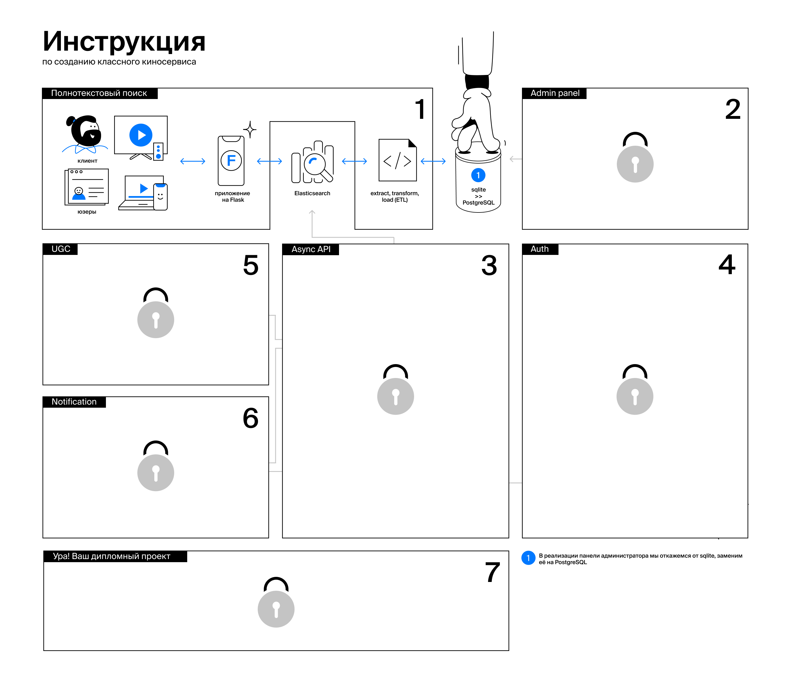

# Техническое задание на первый курс: сервис полнотекстового поиска по базе фильмов

Middle-разработчик сам выбирает технологии для разработки продукта. По ходу работы он должен отвечать на важные технические вопросы:

- Как выбрать базу для хранения 10 терабайт данных?
- Как выдержать нагрузку больше 10 000 RPS?
- Как при отказе целого дата-центра оставить сервис доступным для пользователей?
- Какую архитектуру использовать: монолитную или микросервисную?

В начале курса вы познакомитесь с различными техническими задачами и способами их решения. К середине курса вам придётся принимать решения самостоятельно и защищать их на архитектурных комитетах.

На первой неделе обучения мы проверим ваши навыки и убедимся, что вы готовы к полному погружению в учебный процесс. Вам предстоит реализовывать сервис, который выполняет роль точки входа в онлайн-кинотеатр. Он будет состоять из нескольких модулей:

1. ETL-скрипт [(Extract, transform, load)](https://en.wikipedia.org/wiki/Extract,_transform,_load){target="_blank"}, который отвечает за миграцию данных из SQLite в движок полнотекстового поиска. Не пугайтесь, SQLite не выполняет роль основного хранилища, а используется для обмена данными. Мы подумали, что просить вас [написать парсер больших json-файлов](https://stackoverflow.com/questions/10382253/reading-rather-large-json-files-in-python/10382359#10382359){target="_blank"} — не самая хорошая идея :)   
2. API-эндпоинты, которые отвечают за бизнес-логику сервиса. В первой итерации необходимо реализовать несколько методов:
    - Получение списка всех видеофайлов, которые есть в БД:

    ```http request
    /api/v1/video/collection?limit=50&page=int&search=str&sort=str&sort_order=str

    // search — поиск с учётом морфологии по атрибутам фильма (название, описание, режиссёр и т.д.).
    // limit — количество элементов в выдаче.
    // page — страница в выдаче.
    // sort — сортировка по определённому полю.
    // sort_order — направление сортировки.
    ```

    - Получение карточки одного конкретного видеофайла:

    ```http request
    /api/v1/video/get/<id:str>
    ```

    - Получение информации о клиенте:

    ```http request
    /client/info
    ```

Мы рассчитываем, что продукт сможет работать с десктопными и мобильными приложениями, смарт-телевизорами и даже [чайниками](https://developer.mozilla.org/en-US/docs/Web/HTTP/Status/418){target="_blank"}. 

А вот схема вашего будущего онлайн-кинотеатра. Сейчас открыт только первый сервис. Чтобы узнать, что под замками, дойдите до конца бесплатного курса :)



Сервис полнотекстового поиска — это всего лишь часть одной большой системы. Он взаимодействует с другими микросервисами, используя HTTP-запросы и схемы для заключения контрактов.

## Стек технологий

- Flask;
- SQLite;
- ETL (sqlite → ElasticSearch);
- Raw SQL (наследие от готовой DB);
- Swagger (описание интерфейсов для работы с клиентом);
- Smoke tests (Postman как интерфейс для тестирования).

## Навыки

Для успешного прохождения курса вам нужен опыт работы с Python и любым популярным web-фреймворком для него. Вы должны справляться с тривиальными запросами в базу данных для получения конкретных записей и не пугаться работы с консолью. Пригодится умение читать логи и понимать по ним, почему возникла ошибка и как её исправить. Наличие проекта на [GitHub](https://github.com/){target="_blank"} или его аналогах будет плюсом. 

Если вы чувствуете, что сейчас у вас недостаточно навыков для этого курса, попробуйте начать с курса [Python-разработчик](https://praktikum.yandex.ru/backend-developer/){target="_blank"}. Или же подтяните навыки на работе и собственных проектах и возвращаетесь к нам 😉

## А буду ли я потом использовать сервис для полнотекстового поиска?

Конечно! Он — часть вашего будущего кинотеатра. Как и последующие 6 сервисов. Вы не сделаете сразу финальную версию сервиса, но наработки понадобятся в будущем.