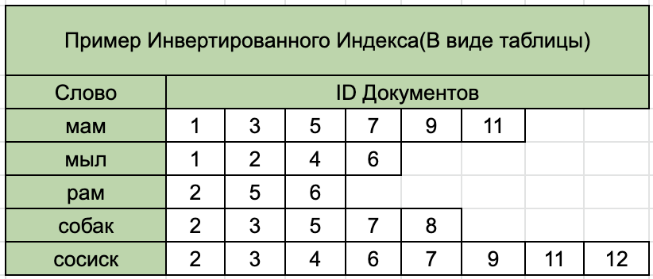

# Полнотекстовый поиск


Не все пользователи знают точные названия фильмов: кто-то помнит название на английском, кто-то — часть названия на русском. Чтобы ваш сервис находил именно то, что нужно, нужно внедрить полнотекстовый поиск.

## Обработка данных поисковым движком

Разберёмся, как это работает. В отличие от БД, в поисковом индексе данные хранятся не в том виде, в котором их загружают. Любые данные, которые попадают в индекс, предварительно обрабатываются анализатором.

Анализатор — это набор правил и функций, которые преобразуют исходную строку в набор токенов. Иначе говоря, в понятный для ES формат. Анализаторы состоят из одного [Tokenizer](https://www.elastic.co/guide/en/elasticsearch/reference/current/analysis-tokenizers.html){target="_blank"} и нескольких необязательных [TokenFilters](https://www.elastic.co/guide/en/elasticsearch/reference/current/analysis-tokenfilters.html){target="_blank"}. 

Tokenizer может также предшествовать нескольким [CharFilters](https://www.elastic.co/guide/en/elasticsearch/reference/current/analysis-charfilters.html){target="_blank"}. Tokenizer разбивает исходную строку на токены, например, по пробелам и символам пунктуации. Также он может изменять токены, удалять или добавлять новые, например, оставлять только основу слова, убирать предлоги, добавлять синонимы. CharFilter изменяет исходную строку целиком, например, вырезает html-теги.

Рассмотрим пример. Нужно добавить в индекс документ с текстом «Мама \<b>мыла\</b> раму». В общем случае обработка этой строки будет такая:

1. CharFilter вырезает весь html-код → «Мама мыла раму».
2. Tokenizer разбивает на токены по пробелам и знакам пунктуации → Мама, мыла, раму.
3. TokenFilter переводит все токены в нижний регистр → мама, мыла, раму.
4. TokenFilter делает {{стемминг}}[p2f_stemming] всех токенов → мам, мыл, рам.

{Стемминг — это нахождение основы слова для заданного исходного слова. Основа необязательно совпадает с морфологическим корнем слова.}

Именно получившиеся токены попадут в индекс. Чтобы искать по таким данным, нужно привести поисковый запрос к такому же формату, т.е. прогнать через тот же анализатор. Получается, для поиска документа «Мама мыла раму» по запросу «мыла», вы на самом деле будете искать «мыл».

Подробнее про токенизацию и весь процесс анализа текста можно узнать [в статье на Хакер.ру](https://xakep.ru/2015/06/11/elasticsearch-tutorial/){target="_blank"}.

## Устройство индекса
Рассмотрим простой пример работы полнотекстного поиска c {{инвертированным индексом}}[p2f_invert_index] и [TF-IDF-метрикой](https://ru.wikipedia.org/wiki/TF-IDF){target="_blank"}.

{Структура данных в поиске, в которой для каждого слова хранятся списки документов, где оно встречается}



Имея индекс в таком виде, уже можно выполнять поиск: разбить запрос на слова и выбрать документы для каждого. Однако у такого метода есть один большой недостаток — система будет выдавать абсолютно все документы, в которых встречается хотя бы одно слово запроса. Представьте, что будет, если это предлог. Поэтому нужно уметь ранжировать результаты.

Для ранжирования нужно рассчитать, насколько документ релевантен запросу. Например, во время поиска считать сколько слов из запроса входит в документ: чем больше слов встречается, тем больше подходит документ. Можно сохранять в индексе не только документы, в которых встретилось слово, а ещё и местоположение слова в документе. Тогда можно ставить бо́льший вес тем документам, в которых слова стоят рядом или ближе к началу. Можно сохранять и место документа — заголовок или тело. Если слово встречается в заголовке, оно имеет бо́льший вес, чем то же слово в теле документа.  

Воспользуемся проверенной метрикой [TF-IDF](https://ru.wikipedia.org/wiki/TF-IDF){target="_blank"}. Она используется абсолютно во всех поисковых системах как один из компонентов, а большинство доступных библиотек опираются на неё как на основную. При всём прочем, метрика достаточно простая. Фактически это произведение двух метрик: TF × IDF.

TF (Term Frequency) — это частотность термина, которая измеряет, насколько часто слово встречается в документе. В длинных документах термин может встречаться чаще, чем в коротких, поэтому абсолютные числа использовать не получится. Вместо них применяют относительные — делят количество вхождений слова в документе на общее количество слов.

IDF (Inverse Document Frequency) — это обратная частотность документов, которая измеряет важность термина. То есть, когда вы считали TF, все термины считаются как будто бы равными по важности относительно друг друга. Но всем известно, что, например, предлоги встречаются очень часто, хотя практически не влияют на смысл текста. И что с этим делать? Ответ прост — посчитать IDF. Он считается как логарифм от общего количества документов, делённого на количество документов, в которых встречается искомый термин.

Таким образом, метрика TF-IDF — это произведение этих двух частот. То есть самое большевесное TF-IDF-слово — то, которое чаще всего встречается в одном документе, и реже во всех остальных. Чем больше «важных» слов из запроса входит в определённый документ, тем он более релевантен.

Посмотрим на полный пример:

* Обрабатываем поисковый запрос анализатором, который используется в индексе.
* Достаём все документы, соответствующие запросу.
* Считаем необходимые метрики.
* Сортируем результаты запроса по рассчитанным метрикам.

Пора искать!

## Полнотекстовый поиск в ElasticSearch

Посмотрим, как изменится схема данных, чтобы вы могли искать по полю `text_field`. Создаём новый индекс `table2`, который уже содержит тип данных `text` для поля `text_field`:

```bash
curl -XPUT http://127.0.0.1:9200/table2 -H 'Content-Type: application/json' -d'
{
	"mappings": {
		"properties": {
			"text_field": {"type": "text"},
			"number": {"type": "long"}
		}
	}
}'
```

Ранее используемый тип `keyword` уже не подходит, потому что он позволяет искать только точные совпадения текста. С другой стороны, он занимает меньше места в памяти и быстрее работает. Тип `text` наоборот позволяет вести поиск по подстрокам.

Зальём какие-нибудь данные, содержащие текст, и посмотрим, как работает поиск.

```bash
curl -XPOST http://127.0.0.1:9200/table2/_doc/ -H 'Content-Type: application/json' -d '{
	"text_field": "my pretty text",
	"number": 15
}'

curl -XPOST http://127.0.0.1:9200/table2/_doc/ -H 'Content-Type: application/json' -d '{
	"text_field": "my code is perfect",
	"number": 16
}'
```

Теперь попробуем найти запись по слову «my».

```json
GET /table2/_search
{
	"query": {
		"bool": {
			"must": [
				{"match": {"text_field": "my"}}
			]
		}
	}
}
```

Разберём этот запрос. `query` — главный ключ, с помощью которого вы говорите ES, что нужно искать. `bool` — это тип запроса. Он сопоставляет документы, соответствующие логическим комбинациям других запросов. `bool`-запрос построен с использованием одного или нескольких логических предложений, каждое из которых имеет типизированное вхождение. 

Типы событий: 

* `must` — возвращённые данные обязательно должны соответствовать правилу, которое описано в этом ключе.
* `must_not` — возвращённые данные не должны соответствовать правилу, описанному в этом ключе.
* `filter` — похож на `must`, но с одним отличием. Найденные с помощью этих правил совпадения не будут участвовать в расчёте релевантности. 
* `should` — возвращаемые данные обязательно должны соответствовать хотя бы одному правилу, которое описано в этом ключе. Он работает как ИЛИ для всех описанных внутри ключа правил.

И наконец `math` — это описание действия, сам поиск. ES умеет обрабатывать не только полнотекстный поиск, но и разные фильтрации. Указание действия — важная часть. Дальше нужно описать, что и по чему нужно искать.

Посмотрим на результат:

```json
{
	"took": 748,
	"timed_out": false,
	"_shards": {
		"total": 1,
		"successful": 1,
		"skipped": 0,
		"failed": 0
	},
	"hits": {
		"total": {
			"value": 2,
			"relation": "eq"
		},
		"max_score": 0.19363807,
		"hits": [
			{
				"_index": "table2",
				"_type": "_doc",
				"_id": "pZGOiXIB-W6dcc_UOY3g",
				"_score": 0.19363807,
				"_source":{
					"text_field": "my pretty text",
					"number": 15
				}
			},
			{
				"_index": "table2",
				"_type": "_doc",
				"_id": "ppGOiXIB-W6dcc_Ue41V",
				"_score": 0.17225474,
				"_source": {
					"text_field": "my code is perfect",
					"number": 16
				}
			}
		]
	}
}
```

Первое, что бросается в глаза — время выполнения. На один простой запрос к индексу с двумя записями Elasticsearch потратил 748 миллисекунд! Это непозволительная роскошь — заставлять пользователя ждать столько времени. 

Давайте разберёмся, что произошло. Если после первого запроса посылать новые, то ответ будет возвращаться за 1–5 миллисекунд. Так происходит из-за того, что по умолчанию новые данные в полях с типом `text` не обрабатываются сразу. Они обрабатываются только при первом запросе к ним. Такое поведение называется ленивой загрузкой. Она была бы уместной, если бы новые фильмы не выходили в прокат. Однако, они выходят, поэтому нужно найти способ уменьшить задержки ответов.

Решение этой проблемы достаточно простое. Чтобы Elasticsearch перестраивал индекс, можно сделать одну из двух вещей:

1. Обновлять индекс вручную:

    ```bash
    curl http://127.0.0.1:9200/_refresh
    ```

2. Попросить Elasticsearch обновлять индекс с некоторой периодичностью, например, каждую секунду:

    ```bash
    curl -XPUT http://127.0.0.1:9200/table2/_settings -H 'Content-Type: application/json' -d '{
            "refresh_interval": "1s"
    }'
    ```

Всегда нужно помнить, что обновление индекса занимает время, а главное — тормозит загрузку данных. О загрузке данных в индекс поговорим чуть позже.

Итак, теперь данные в вашем будущем видеосервисе находятся достаточно быстро. Однако есть и другая проблема: если вбить в поиск не всё слово целиком, а только часть, система откажется искать такие записи. Здесь на помощь приходит нечёткий поиск.

Нечёткий поиск — это поиск, в котором вы ищете не только исходный запрос, но и похожий на него. Самый частый пример — опечатки пользователя. Пользователь может спешить и опечататься: написать «мыда», хотя хотел набрать «мыла». В таком случае всё равно должны отобразиться результаты поиска. Работает это достаточно просто. Когда вы достаёте данные из индекса, вы достаёте не только по полному совпадению, но и похожие строки. 

Остался вопрос: как оценить похожесть двух строк? Самая популярная метрика сравнения похожести двух строк — это [расстояние Левенштейна](https://ru.wikipedia.org/wiki/Расстояние_Левенштейна){target="_blank"}. Фактически это необходимое количество односимвольных операций вставки, удаления или изменения для превращения одной строки в другую. В примере для превращения «мыда» в «мыла» нужна одна операция замены:  «д» → «л». Значит, расстояние будет равно 1. 

На практике возникает ещё одна ситуация, когда пользователь в спешке напутал порядок символов. Хотел набрать «мыла», а получилось «мыал». Расстояние Левенштейна будет равно 2. Но если выполнить одну операцию перестановки — поменять «а» и «л» местами, то получим исходное слово. Для обработки таких сценариев к расстоянию Левенштейна добавили операцию транспозиции или перестановки. Так получилась новая метрика — [расстояние Дамерау — Левенштейна](https://ru.wikipedia.org/wiki/Расстояние_Дамерау_—_Левенштейна){target="_blank"}. Именно она и используется в ES.

Посмотрим, как это работает. Запрос с использованием нечёткого поиска можно переписать так (для наглядности добавим ещё одну запись):

```bash
curl -XPOST http://127.0.0.1:9200/table2/_doc/ -H 'Content-Type: application/json' -d '{
	"text_field": "my white board",
	"number": 17
}'

curl -XGET http://127.0.0.1:9200/table2/_search -H 'Content-Type: application/json' -d '
{
	"query": {
		"match": {
			"text_field": {
				"query": "whit code", 
				"fuzziness": "auto"
			}
		}
	}
}'
```

Разберём этот запрос. Здесь вместо уже знакомого `bool`, используется тип запроса `match`. Это стандартный запрос для выполнения полнотекстового поиска, включая варианты нечёткого поиска. 

Результат:

```json
{
  "took": 3,
  "timed_out": false,
  "_shards": {
    "total": 1,
    "successful": 1,
    "skipped": 0,
    "failed": 0
  },
  "hits": {
    "total": {
      "value": 2,
      "relation": "eq"
    },
    "max_score": 1.3907259,
    "hits": [
      {
        "_index": "table2",
        "_type": "_doc",
        "_id": "ppGOiXIB-W6dcc_Ue41V",
        "_score": 1.3907259,
        "_source": {
          "text_field": "my code is perfect",
          "number": 16
        }
      },
      {
        "_index": "table2",
        "_type": "_doc",
        "_id": "wpG1iXIB-W6dcc_U240G",
        "_score": 1.1807568,
        "_source": {
          "text_field": "my white board",
          "number": 17
        }
      }
    ]
  }
}
```

Параметр `fuzziness` указывает порог расстояния схожести двух строк. То есть максимальное значение расстояния Дамерау — Левенштейна, которое будет рассматривать ES. 

При просмотре строки Elasticsearch применяет разные правила в зависимости от длины каждого слова при значении `auto` у `fuzziness`. Каждое правило предполагает определённое количество допустимых замен символов согласно расстоянию Дамерау — Левенштейна. Это значение рекомендуется применять при использовании нечёткого поиска. Для более тонкой настройки можно обратиться к [официальной документации](http://elastic.co/guide/en/elasticsearch/reference/current/common-options.html#fuzziness){target="_blank"} на английском.

Тот же запрос можно переписать по-другому:

```bash
curl -XGET http://127.0.0.1:9200/table2/_search -H 'Content-Type: application/json' -d ' 
{
    "query": {
        "query_string": {
            "default_field": "text_field",
            "query": "whit~ code"
        }
    }
}'
```

Здесь уже применяется {{язык запросов}}[p2f_theme10_lesson3_python_querylanguage] для текста. Символ `~` обозначает, что должен производиться нечёткий поиск для слова в запросе `«whit»`. Такой способ написания — это язык запросов Apache Lucene. Более подробно про язык запросов стоит почитать в [официальной документации](https://www.elastic.co/guide/en/elasticsearch/reference/current/query-dsl-query-string-query.html){target="_blank"} на английском.

Осталось осветить последний вопрос: а как же искать по русским словам?

Если использовать тип данных `text`, то «из коробки» вы получаете поиск по словам с английским алфавитом. Это легко проверить. Достаточно добавить пару–тройку записей с русским текстом и попытаться сделать поиск по ним.

```bash
curl -XPOST http://127.0.0.1:9200/table2/_doc/ -H 'Content-Type: application/json' -d '{
	"text_field": "Хороший разработчик — на вес золота",
	"number": 15
}'

curl -XPOST http://127.0.0.1:9200/table2/_doc/ -H 'Content-Type: application/json' -d '{
	"text_field": "Мой код превосходен",
	"number": 16
}'
```

Добавим запрос.

```bash
curl -XGET http://127.0.0.1:9200/table2/_search -H 'Content-Type: application/json' -d ' 
{
    "query": {
        "query_string": {
            "default_field": "text_field",
            "query": "разработчик говорить"
        }
    }
}'
```

Запрос уже не найдёт текста на русском. Это значительно уменьшает возможности применения стандартного механизма поиска.

К счастью, разработчики Elasticsearch позаботились о такой проблеме и добавили использование собственных анализаторов, в том числе и для русского языка.

Для подключения русского языка необходимо задать настройки анализатора при создании индекса.

```bash
curl -XPUT http://127.0.0.1:9200/table3 -H 'Content-Type: application/json' -d'
{
  "settings": {
		"refresh_interval": "1s",
    "analysis": {
      "filter": {
        "russian_stop": {
          "type":       "stop",
          "stopwords":  "_russian_" 
        },
        "russian_stemmer": {
          "type":       "stemmer",
          "language":   "russian"
        }
      },
      "analyzer": {
        "ru": {
          "tokenizer":  "standard",
          "filter": [
            "lowercase",
            "russian_stop",
            "russian_stemmer"
          ]
        }
      }
    }
  },
  "mappings": {
    "dynamic": "strict",
    "properties": {
      "text_field": {
        "type": "text",
        "analyzer": "ru"
      },
      "number": {
        "type": "long"
      }
    }
  }
}'
```

Для улучшения поиска достаточно добавить стеммер и стоп-слова. После этого поиск по тем же данным, что и в `table2`, вернёт вам одну строчку. 

В начале урока вы уже разбирали анализторы, фильтры, стемминг. Но не разбирали, что такое стоп-слова и зачем они нужны. Фактически это массив слов, которые ES будет игнорировать при индексации. Чаще всего он состоит из предлогов и частиц. Например, союз «и» используется практически во всех документах, и сам по себе он не несёт какой-то полезной информации. Поэтому его лучше игнорировать как при индексации, так и при обработке поискового запроса.

Для более глубокого ознакомления с темой анализаторов советуем ознакомиться с [официальной документацией](https://www.elastic.co/guide/en/elasticsearch/reference/current/analysis-custom-analyzer.html){target="_blank"} на английском.