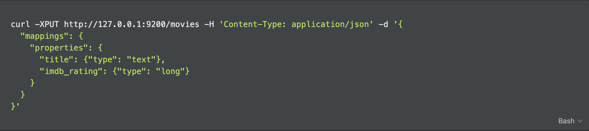
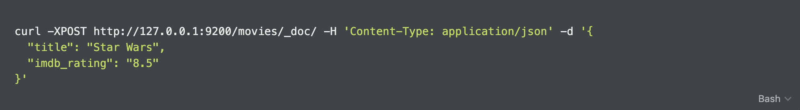
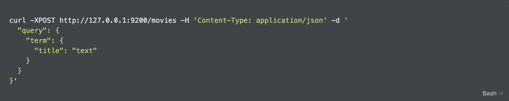

# Квиз

1. Выберите невалидные имена для индекса Elasticsearch.
    - `_name` → В начале имени не может стоять символ `_`. 
    - ✅ `.inner` → Валидно, но только для скрытых и системных индексов.
    - `master:slave` → Нельзя использовать символ `:`. 
    - `..` → Имя не может быть двумя точками.
    - ✅ `^happy^` → Валидное имя.
    - `Base` → Нельзя использовать заглавные буквы.


2. Какие команды могут создать новый индекс?
    - ✅ Правильно → Это прямой запрос на создание индекса.

        ```bash
        curl -XPUT http://127.0.0.1:9200/movies -H 'Content-Type: application/json' -d '{
        	"mappings": {
        		"properties": {
        			"title": {"type": "text"},
        			"imdb_rating": {"type": "long"}
        		}
        	}
        }'
        ```

        

    - ✅ Правильно → Если индекса не было, команда создаёт его и записывает данные.

        ```bash
        curl -XPOST http://127.0.0.1:9200/movies/_doc/ -H 'Content-Type: application/json' -d '{
        	"title": "Star Wars",
        	"imdb_rating": "8.5"
        }'
        ```

        

    - Неправильно → Здесь представлен запрос на поиск данных.

        ```bash
        curl -XPOST http://127.0.0.1:9200/movies -H 'Content-Type: application/json' -d '
        	"query": {
        		"term": {
        			"title": "text"
        		}
        	}
        }'
        ```

        

    - Неправильно → Здесь представлен запрос на обновление настроек индекса.

        ```bash
        curl -XPUT http://127.0.0.1:9200/movies/_settings -H 'Content-Type: application/json' -d '{
        	"refresh_interval": "1s"
        }'
        ```

        
        

3. Какие поля документа, кроме самих данных, могут измениться при обновлении?
    - ✅ `_version` → Версия изменяется при обновлении данных.
    - `_id` → Не меняется, так как обновление идёт по этому полю.
    - `_shards` → Не меняется, так как относится к настройкам индекса.
    - ✅ `_seq*_*no` → Меняется, так как изменение данных влияет на другие запросы.
    - `_type` → Не меняется, тип не зависит от данных.
    - ✅ `_primary_term` → Может измениться, потому что тесно связан с `_seq*_*no`.
