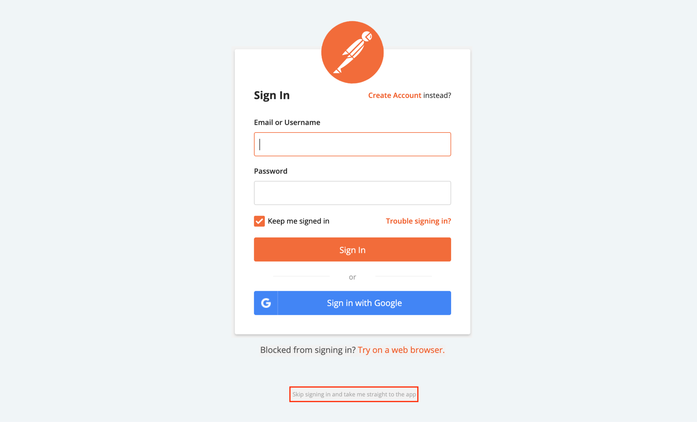
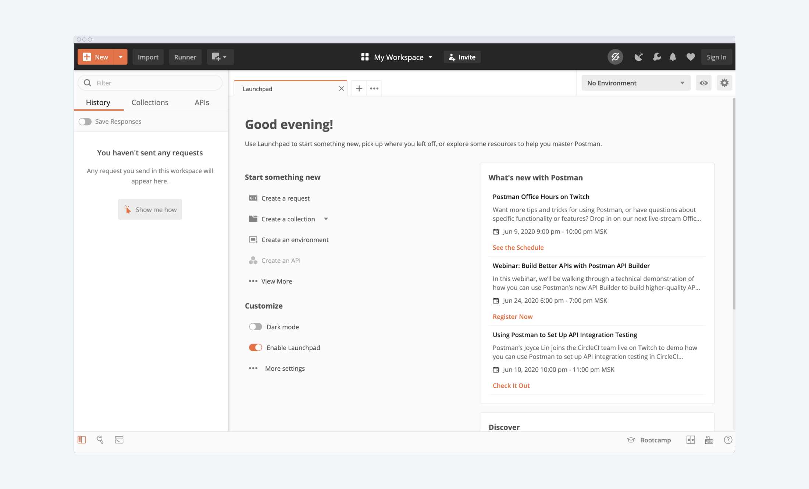
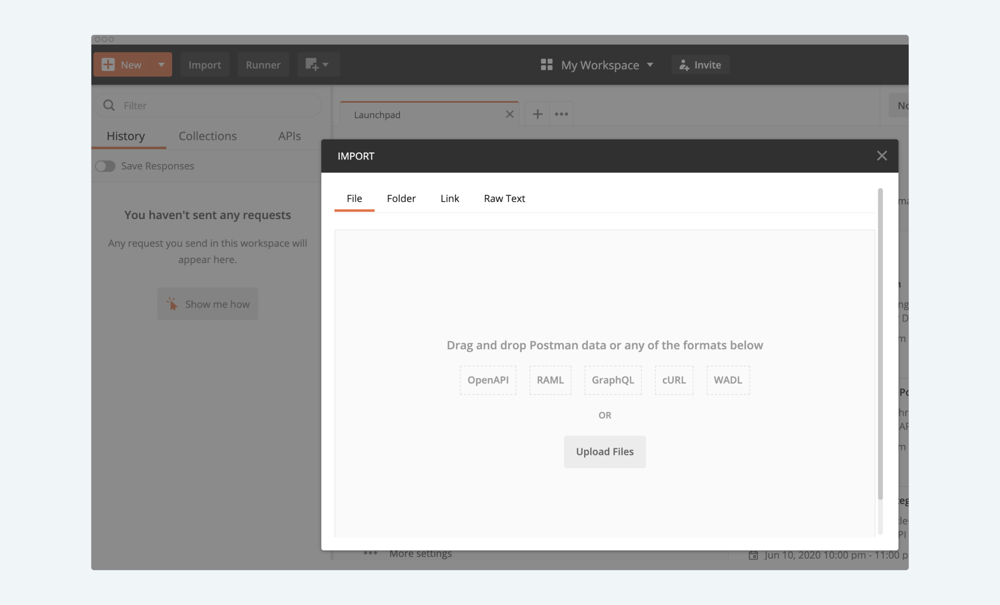
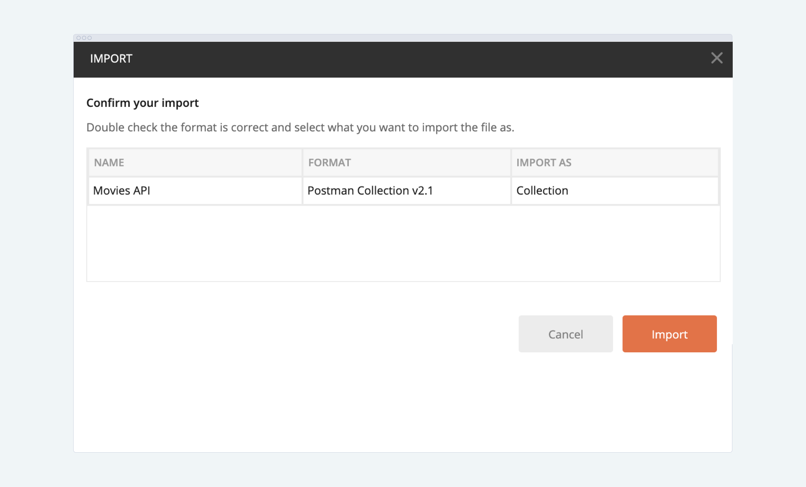
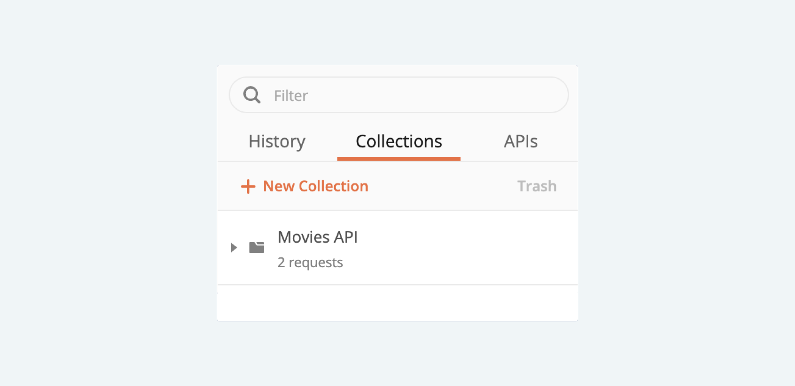
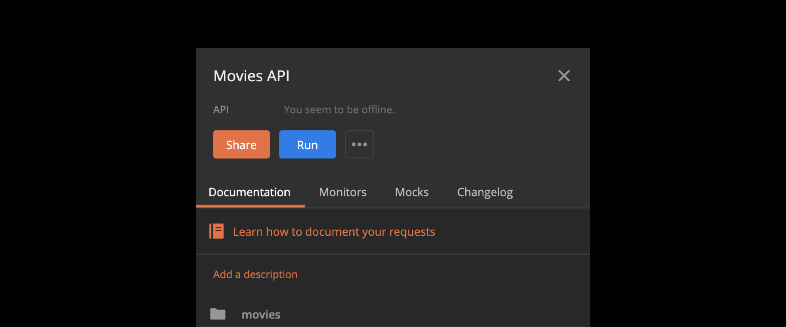
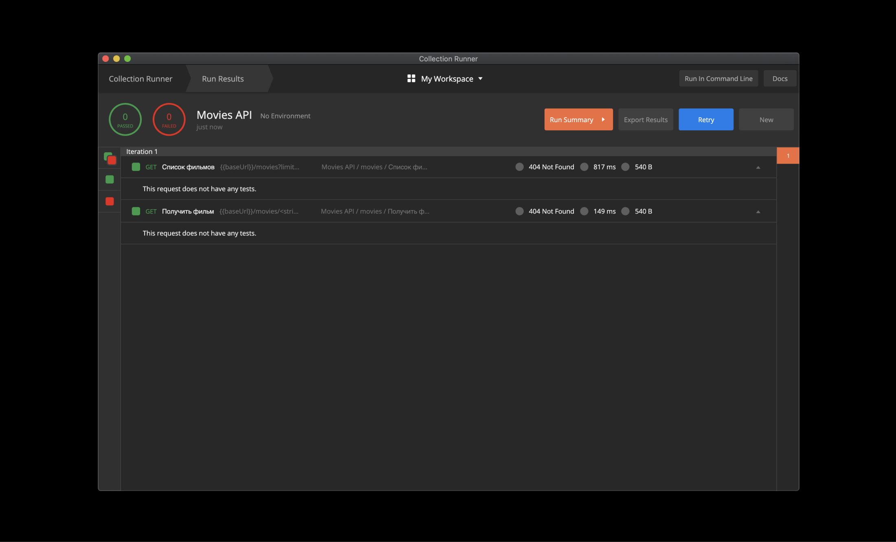

# Тестирование решения

После того, как всё будет готово, протестируйте ваш ETL-механизм. 

Мы написали набор тестов для программы [Postman](https://www.postman.com/downloads/){target="_blank"}, построеных таким образом, чтобы проверить получение определённых фильмов на заданный запрос. 

[Ссылка на файл с тестами](https://code.s3.yandex.net/middle-python/learning-materials/ETLTests.json){target="_blank"}💾 — чтобы вы его точно не потеряли.

---

## Установка Postman и импорт тестов

Чтобы было проще разобраться, как именно запускать тесты, проведём небольшой разбор программы для тестирования Postman. 
Её можно скачать с официального сайта для[ Mac, Linux или Windows](https://www.postman.com/downloads/){target="_blank"}.
Если Postman вам уже знаком, то дальнейшую инструкцию по импорту тестов можно не читать.

После запуска появится окно входа. Вам нужна работа программы без входа (красный прямоугольник на картинке).

После входа вы увидите основной интерфейс программы.

Далее нужно загрузить тесты. Делается это кнопкой Import слева вверху. [Пример подготовленных тестов](https://code.s3.yandex.net/middle-python/learning-materials/Movies%20API.json){target="_blank"}.

После этого программа предложит переименовать коллекцию запросов (Collection). Оставим всё, как есть.

Перейдите во вкладку Collections.

Тесты импортированы.

## Запуск тестов

Наведите курсор на коллекцию тестов Movies API и нажмите на стрелку (в синем квадрате).

Перед вами появляется интерфейс запуска тестов.

Нажмите на кнопку Run — появится окно настройки. Пока видно только два запроса, но на практике их больше.

Нажмите на кнопку Run Movies API и посмотрите на результаты тестирования. 
В данном примере запросы посылались в заглушку, поэтому отдаются ошибки 404.

Теперь вы научились запускать тесты, используя мощный инструмент тестирования Postman. 
Если хочется узнать о нём побольше, стоит обратиться к [официальной документации](https://learning.postman.com/docs/postman/launching-postman/introduction/){target="_blank"} на английском.